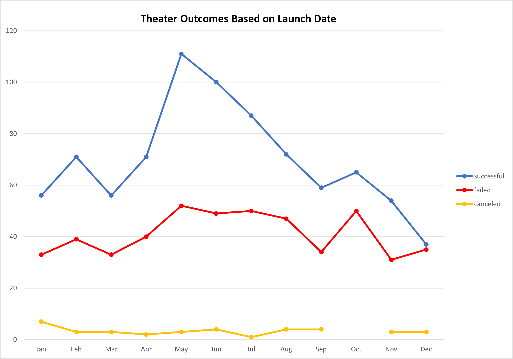

# Kickstarting with Excel

## Overview of Project

### Purpose
The purpose of this project is to examine Kickstarter data to uncover trends and determine the best course of action for Louise to take in launching her first ever Kickstarter campaign to fund her play, "Fever."  Louise has a goal to raise over $10,000 for her production. 

## Analysis and Challenges

The analysis was performed by extracting historical crowd-funding data which was then organized, sorted, and analyzed.  

I created a pivot table for Theater Outcomes by Launch Date data which was filtered by Parent Category "Theater" to observe the Count of Outcomes for the Successful, Failed, and Canceled Theater campaigns by month (using the Years filter). I then created a line chart to graph the results.

I created a table for the Outcomes Based on Goals data to include dollar ranges to group goal amounts using the =COUNTIFS formula.  I then calculated the Total Projects using the =SUM formula, along with calculating the percent of Successful, Failed, and Canceled campaings (=ROUND(number of projects/total projects,2) expressed as a percentage. Next, I created a line chart to graph the results.

### Analysis of Outcomes Based on Launch Date

### Analysis of Outcomes Based on Goals

### Challenges and Difficulties Encountered
I encountered a challenge with the Outcomes Based on Goals graph not appearing like the expected results. After carefully reviewing the instructions and data selected, I discovered that I was utilizing the "pledged" column instead of the "goal" column in my formula.  As a result, I had to reconfigure my formula with the correct column information. 

## Results
The Outcomes Based on Launch Date data indicated that May, by far, was the most successful month to launch a campaign.  The months following May, up until July, are also successful, but show a steady decline with December being the least successful month of all.  In addition, May and June appeared to be the most popular months for launching campaigns.  Of the 1,369 campaigns analyzed, 61% were successful, 36% failed, and 3% were canceled. 

The Outcomes Based on Goals data indicated that campagins with a goal of less than $1,000 appeared to be most successful. Campaigns ranging in $1,000 to $4,500 were the next most successful; and also had the highest total number of projects and highest number of failed campaigns.  Campaigns in the range of Louise's goal of $10,000 to $14,999 were 54% successful. 

There are limitations to this analysis based on the current data set.  I think it would be useful to have geographical data to compare with Louise's location. For example, if the majority of successful campaigns are in Texas, New York, and California, but Louise is in Kentucky where most campaigns fail, that would be extremely useful to know. It would also be helpful to have the plays identified by genre to determine if genre influences campaign success.  In addition, knowledge as to whether or not any incentives were used in campaigns to increase their success such as buy one get one tickets, best choice of seating, or free travel mugs were used.

There are other possible ways to examine this data. It would be useful to specify the dataset further by Country and exclude locations not pertinent to Louise.  It would also be useful to exclude the Subcategory of "musical" and "spaces" from the Theater Outcomes by Launch Date data such that both sets of data analyzed used the same data set.  A Bar Graph would be visually appealing to represent the Outcomes Based on Goal data.  In addition, adding a Histogram chart to highlight information gathered through the Descriptive Statistics exercise in the Module to establish Mean, Median, Standard Deviation, and Interquartile Ranges (and excluding outliers) would provide additional data and different insights for Louise.
